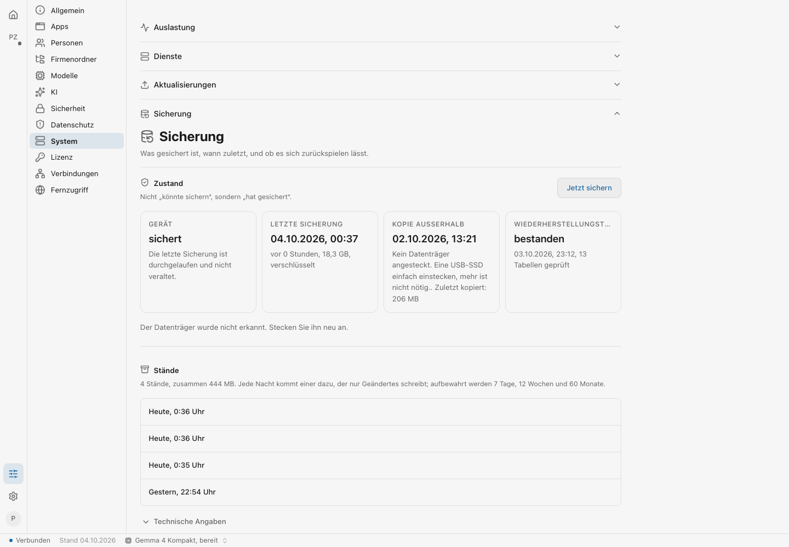
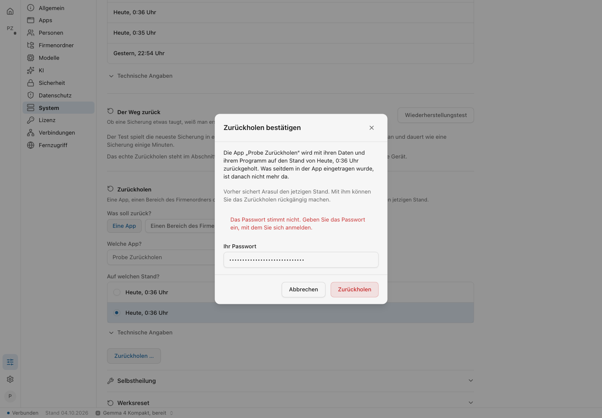
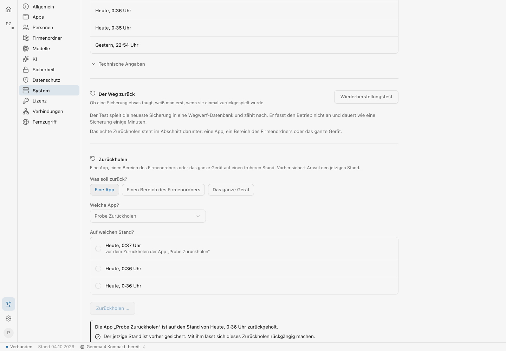
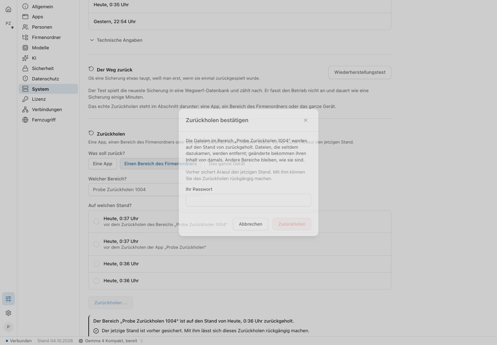
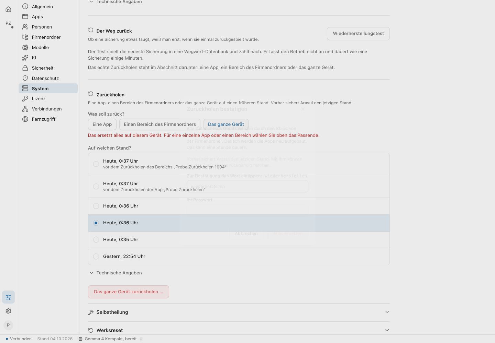
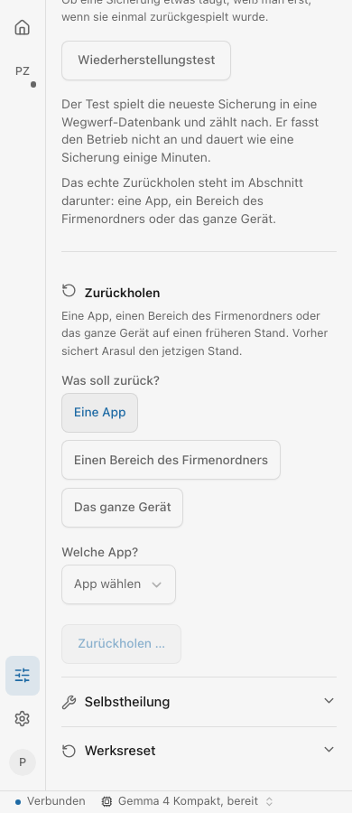

# Abnahme: einen früheren Stand zurückholen (M5)

Auftrag `sicherung-zurueckholen`, am Orin gemessen in der Nacht vom 03. auf den
04.10.2026, nach #867 (Zurückholen) und #868 (Aufbewahrung). Skript:
`scripts/test/sicherung-zurueckholen-abnahme.sh` mit
`sicherung-zurueckholen-bilder.mjs`, angemeldet als `probe-admin`.

## Ergebnis

**Lauf 2: 42 grün, 0 rot.** Browser-Teil 22 grün, 0 rot.

| Was                                                                                    | Ergebnis                                                                                                                                                                                                                                         |
| -------------------------------------------------------------------------------------- | ------------------------------------------------------------------------------------------------------------------------------------------------------------------------------------------------------------------------------------------------ |
| Ort                                                                                    | Verwaltung → System → Sicherung → Zurückholen, genau einmal auf der Seite (den Bereich „Daten“ gibt es noch nicht)                                                                                                                               |
| Stände in Worten                                                                       | „Heute, 0:36 Uhr“, „Gestern, 22:54 Uhr“; keine Kennung in Liste und Auswahl                                                                                                                                                                      |
| ohne Passwort / falsches Passwort                                                      | 400 / 403 `PASSWORT_FALSCH`, Satz im Dialog; nichts angefasst (5 Einträge, kein neuer Stand)                                                                                                                                                     |
| (a) App `probe-rueck-1004` auf Stand A                                                 | 3 Einträge statt 5, Paket `server.js` Byte für Byte wie in A                                                                                                                                                                                     |
| (b) Bereich `probe-rueck-1004` auf Stand A, über WebDAV gelesen                        | `angebot.txt` wieder A, `unterordner/notiz.txt` wieder da, `neu-nach-a.txt` weg; der Dateidienst lief durch                                                                                                                                      |
| Stand davor                                                                            | je einer mit `vorher` und `fuer` (`app:probe-rueck-1004`, `bereich:probe-rueck-1004`)                                                                                                                                                            |
| rückgängig mit dem Stand davor                                                         | Bereich und App wieder wie in B (5 Einträge, Paket B, Dateien B)                                                                                                                                                                                 |
| (c) ganzes Gerät, Wegwerf-Umgebung (eigenes Postgres, eigener Schlüssel, eigenes Netz) | auf A: `personen=Anna app=A paket=A firma=A neu=nein`; mit dem Stand davor zurück: `Anna,Bruno A,B B B ja`                                                                                                                                       |
| (c) in der Oberfläche                                                                  | Weg bis in den Dialog (Wort eingetippt, ohne Passwort gesperrt), abgebrochen; kein Aufruf an `/api/backup/wiederherstellung`                                                                                                                     |
| 390 px                                                                                 | nichts läuft seitlich über                                                                                                                                                                                                                       |
| Aufräumen                                                                              | Recht, Bereich, App (samt Datenbanken), Schlüssel weg; kein Ordner `probe-rueck-1004` unter `/arasul/apps` im Container `dashboard-backend`, keiner in der Ablage; die 6 eigenen Stände einzeln entfernt (`restic forget`), Wegwerf-Umgebung weg |

## Zahlen

|                                                             |             |
| ----------------------------------------------------------- | ----------- |
| Jetzt sichern (Stand A / B)                                 | 10 s / 9 s  |
| App zurück auf A, mit Stand davor (Klick bis Bericht)       | 16 s        |
| Bereich zurück auf A, mit Stand davor                       | 12 s        |
| rückgängig: Bereich / App                                   | 14 s / 18 s |
| Stand davor schrieb neu                                     | 1,9 MB      |
| ganzes Gerät in der Wegwerf-Umgebung (Stand davor + zurück) | 9 s         |

## Funde

1. **Lauf 1 (31 grün, 11 rot): Stand A fiel durch Stand B.** Die Aufbewahrung
   7/12/60 behielt je Tag nur den neuesten Stand; mit A fiel auch der Stand vom
   Dienststart (0:16). Fix in #868: die fünf neuesten Stände bleiben immer
   (`--keep-last 5`). `--keep-within 2d` behielt in restic 0.16.4 jeden Stand
   der Reihe und wurde verworfen.
2. **Fremde Stände desselben Tages:** auch mit #868 verdrängen die sechs
   Stände eines Laufs den Stand vom Dienststart (0:35, `43cf0b29`) aus „die
   fünf neuesten“ und „einer je Tag“. Danach stand am Orin nur noch
   `8cb709d5` (03.10., 22:54); sofort von Hand gesichert: `7749e3ab` (0:40).
   Die Abnahme merkt sich jetzt die Stände vom Anfang, sagt, welcher fiel, und
   legt am Ende selbst einen frischen Stand an.
3. **Bilder:** `bereich-dialog.png` und `geraet-dialog.png` zeigen den Dialog
   beim Ein- bzw. Ausblenden, und nach dem Zurückholen zeigte der
   ausblendende Dialog „auf den Stand von zurückgeholt“ ohne Zeitpunkt. Zwei
   Stände in derselben Minute hießen gleich. Behoben mit diesem PR: Auswahl
   bleibt bis zum Ende, Sekunden nur bei Gleichstand, das Bildskript wartet
   die Animation ab.
4. **Erster Lauf (c):** die Wegwerf-Datenbank kam nicht zustande
   (`CREATE DATABASE` in einer Transaktion); ein Fehler des Skripts, in #868
   behoben.

## Bilder

|                                     |                                                 |
| ----------------------------------- | ----------------------------------------------- |
|               |  |
|     |         |
|  |                            |
